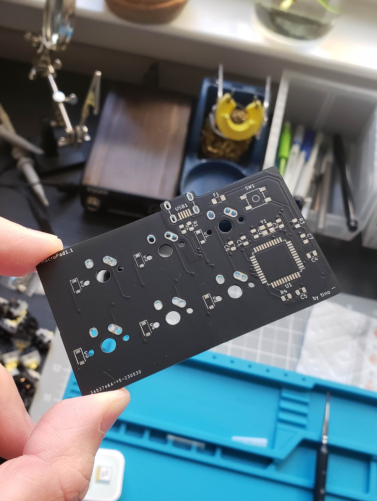

# MacroPad1.0
This small macropad is the prototype and proof of concept for an evolving and iterating design.

Since this will be my first time building the supporting electronics around an ATMEGA32U4 microcontroller, 
as well as building and flashing the firmware from zero, a design with a smaller scope seemed like the best way to jump into things.

## Table of Contents
- [MacroPad1.0](#macropad10)
  - [Table of Contents](#table-of-contents)
  - [General Design Notes](#general-design-notes)
  - [Build Guide](#build-guide)
  - [Case Design Notes](#case-design-notes)
  - [Parts Notes](#parts-notes)
    - [HTML BOM](#html-bom)
    - [1. MCU](#1-mcu)
    - [2. Mini USB Connector](#2-mini-usb-connector)
    - [3. Fuse](#3-fuse)
    - [4. Capacitors](#4-capacitors)
    - [5. Resistors](#5-resistors)
    - [6. Reset Switch](#6-reset-switch)
    - [7. Crystal Oscillator](#7-crystal-oscillator)
    - [8. Diodes](#8-diodes)
  - [PCB Design Notes](#pcb-design-notes)
    - [Schematic](#schematic)
      - [Decoupling Capacitors](#decoupling-capacitors)
      - [Diode Matrix](#diode-matrix)
      - [Crystal Oscillator](#crystal-oscillator)
    - [Layout](#layout)
      - [Layer Count](#layer-count)
      - [Laying Traces](#laying-traces)
      - [USB Traces](#usb-traces)
      - [Decoupling capacitors](#decoupling-capacitors-1)
      - [Grounding mask](#grounding-mask)
      - [Crystal Placement](#crystal-placement)
    - [Production](#production)
      - [Surface Finish](#surface-finish)
      - [MFR](#mfr)
  - [Firmware](#firmware)
  - [Future Improvements](#future-improvements)

## General Design Notes

- Switches
  - This macropad will house 6 mechanical keyswitches, typical MX style and size.
- Dimensions
  - The PCB is 76.66mm x 42.86mm (LxW) with a notch protruding for the USB connector
  - For case designers, more detailed dimensions can be found [Here](KiCad/MacroPad1.0/MacroPad1.1_dims0.pdf) in the KiCad folder.
- Mounting
  - No holes in the PCB means the design is reliant on the plate be the main mounting structure. Either using screw holes or a sandwiched gasket mount design.
  - This is usually preferred in order to decrease the mechanical stress on the PCB itself during operation.
  - Next time include at least *one* hole in the PCB, for emergencies.
- MCU
  - ATMEGA32U4-AUR Microcontroller
  - This variant is actually rather large. for the next iteration thinking about going with the smaller MU variant, which comes in a VQFN package, 7x7mm. This will be more challenging to solder, especially without hot air or solder paste.
- USB Connection
  - Mini USB Connector
  - This is the easiest USB connector to hand solder, due to the size of the pins. good for a first prototype, but I'd like to move toward a more modern connector ASAP.
- Current protection
  - 500mA fuse
- Voltage protection
  - None, reverse voltage protection may have been a good add...

## Build Guide
- I'll create a step by step guide in a different doc soon!

## Case Design Notes
- Coming soon

## Parts Notes

### [HTML BOM](KiCad/MacroPad1.0/bom/MacroPad1.1-BOM.html)

### 1. MCU
  - [ATMEGA32U4-AUR](https://www.digikey.com/en/products/detail/microchip-technology/ATMEGA32U4-AUR/2238241)
  - 44 TQFP Package (10x10mm)
  - easy to solder
    
### 2. Mini USB Connector
  - Molex [0548190589](https://www.digikey.com/en/products/detail/molex/0548190589/2421468)
  - CONN RCPT MINI USB B 5POS SMD RA
  - 5 pin USB, easy to solder

### 3. Fuse
  - [Bel Fuse Inc. C1F 500](https://www.digikey.com/en/products/detail/bel-fuse-inc/C1F-500/4968258)
  - 1206 SMD
  - 500mA fast acting
### 4. Capacitors
  -  0805 SMD
  - 10uF, 0.1uF, 1uF, ~14pF
  - The values marked for C2 and C3 in the HTML BOM are incorrect. if not already updated, these should be replaced with 14pF capacitors. More details in the Crystal section.
### 5. Resistors
  - 0805 SMD
  - 10k: pu/pd resistors
  - 22ohm: USB datalines tx/rx.
### 6. Reset Switch
  - [PTS526 SK15 SMTR2 LFS](https://www.digikey.com/en/products/detail/c-k/PTS526-SK15-SMTR2-LFS/10056626)
  - SPST switch
  - low profile, nice form factor
### 7. Crystal Oscillator
  - [ECS-160-9-33B-CWN-TR](https://www.digikey.com/en/products/detail/ecs-inc/ECS-160-9-33B-CWN-TR/12349449)
  - 16MHz
  - Fragile, be careful when soldering! Use hot air + solder paste if available.
  - Pinout
    - There is a chamfer on the one of the pads underneath the crystal. This identifies pad #1. 
    - Pads #1 and #3 are connected to the two sides of the crystal. Pads #2 and #4 are bonded to the top metal lid and grounded.
  - Orientation
    - According to the layout, pad #1 will correspond to the bottom left pad on the pcb, on the side closest to C2.
    - The crystal is Bidirectional though, so dont worry too much about this.
### 8. Diodes
  - [1N4448W](https://www.digikey.com/en/products/detail/micro-commercial-co/1N4448W-TP/789330)
  - SOD-123 Package
  - fast switching

## PCB Design Notes

### Schematic

#### Decoupling Capacitors
- 0.1uF and 10uF decoupling capacitors are used to remove unwanted power distortion.

#### Diode Matrix
- This design implements a Diode Matrix to determine the keystrokes seen by the microcontroller.
- The Diode Matrix is what allows keyboards with 100+ keys to communicate individual keystrokes. By defining rows and columns and assigning each one to a different i/o port on the microcontroller, we can increase the number of discernable inputs to the microcontroller.
- For this board in particular, I could have mapped each Keyswitch to an individual pin on the MCU, but as more switches and features get added, we'll rapidly run out of space.
- So it's best to get used to using this early on!

#### Crystal Oscillator
- Load Capacitance: 9pF
    - The circuit was originally designed with incorrect values (1uF) chosen for the load capacitors. 
    - we can use the following equation to determine the correct values for the external load capacitors for a parallel resonant crystal.

$$ C_L = (C_{x1}*C_{x2})/(C_{x1} + C_{x2}) + C_{stray} $$

$$C_{x1} = C_{x2}$$

$$ C_x = 2(C_L - C_{stray}) $$

$$ C_L = 9pF, C_{stray} = 2pF$$

$$ \therefore C_x = 14pF$$

- Assuming a stray capacitance of 2pF, our resulting Load Capacitors C2 and C3 should be around **14pF**. (quite a lot lower than 1uF xd)
### Layout

- Initial layout:

- After optimization & improvements:
  - Slightly smaller footprint
  - Better USB Dataline routing
  - no mounting holes LOL
  - Grounding mask

#### Layer Count
- Just using a 2 layer design here, it's a simple enough design that it doesn't really require much more
- Griff recommends four layer, lets try that next time.

#### Laying Traces
- Generally speaking, I tend to like putting horizontal traces on the front side, and vertical traces on the back side of the PCB (or vice versa), connecting with vias where necessary.

#### USB Traces
- USB datalines should be parallel at all times.
- 45 degree angles for traces whenever possible, sharp corners could impact signal integrity.
- I should also have tried to avoid using vias for the USB datalines, since I've read that incorrect use could cause signal reflection and attenuation. No issues so far though!

#### Decoupling capacitors
- Placement and trace routing is important!

#### Grounding mask
- Added Grounding mask around USB, MCU, and Crystal area. 
- none around switches since that shouldn't be an area that would attract too much unwanted noise. Re-assess if possible.

#### Crystal Placement
- Crystal placed as close as reasonably possible to the XTAL pins on the MCU.
- Took care to also place Load capacitors as close to the crystal as possible.
- Long copper traces could interfere with the crystal clock. Undesirable.

### Production

#### Surface Finish
- Lead-free HASL. ENIG would have been pretty, but it's too expensive.

#### MFR
- Produced by JLCPCB, very afforable. Might consider factory population at some point.

## Firmware
- documentation coming soon

## Future Improvements
In order of most to least likely to implement

  1. More switches
  2. Hotswap sockets
  3. Power Indication LED
  5. Rotary encoder
  6. smaller MCU form factor, either VQFN ATmega32u4-MUR, or RP2040
  7. USB C connector, or at least micro USB
  8. RGB
  9. OLED display
  10. Through hole style Crystal Oscillator for easier soldering? low priority, since a smaller MCU will also be difficult to solder
  11. Bluetooth?? + Battery??
